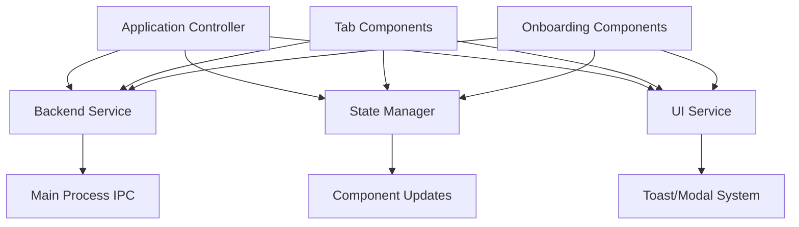

# Comprehensive UI Architecture Document

This document provides a complete analysis of the current UI implementation and detailed specifications for rebuilding the wallet functionality and UI in a better, more scalable way.

---

## 📋 Current State Analysis

### ✅ **Clean Foundation Achieved**

After implementing Vite build system and comprehensive security layer, we now have a **clean, stable foundation**:

```
src/renderer/
├── index.html                  # ✅ Single Vite-managed HTML entry point
├── main.ts                     # ✅ TypeScript entry point with proper imports
├── services/                   # ✅ Clean ES modules
│   ├── BackendService.ts       # ✅ IPC communication layer (52+ handlers mapped)
│   ├── StateManager.ts         # ✅ Centralized state management
│   ├── UIService.ts            # ✅ UI interactions (toasts, modals, loading)
│   └── Utils.ts                # ✅ Helper functions
├── controllers/                # ✅ Application controllers
│   └── WalletSelectionController.ts # ✅ Wallet selection and creation flow
├── utils/                      # ✅ Security utilities
│   └── CryptoUtils.ts          # ✅ Secure password hashing and encryption
└── app/                        # ✅ Application architecture
    └── RuneToolsApplication.ts # ✅ Main application controller

vite.config.js                  # ✅ Vite configuration for Electron
package.json                    # ✅ Updated scripts for modern workflow

dist/renderer/ (generated)
├── index.html                  # ✅ Processed by Vite (complete two-phase UI)
└── renderer.js                 # ✅ Bundled application (25KB gzipped)
```

### ✅ **Problems Solved**

1. **✅ External Script Loading**: Fixed with Vite bundling
2. **✅ Module System**: Proper ES modules with TypeScript
3. **✅ Build Stability**: Reliable Vite build process
4. **✅ Development Workflow**: Hot reloading available
5. **✅ Single Architecture**: Clean foundation ready for expansion
6. **✅ Service Layer**: Working BackendService, StateManager, UIService, Utils
7. **✅ Application Controller**: Two-phase system implemented
8. **✅ TypeScript Support**: Full type safety throughout
9. **✅ Security Implementation**: Complete password hashing and encryption system
10. **✅ Wallet Selection UI**: Complete wallet creation/import/selection interface

---

## 🔒 Security Implementation (COMPLETED)

### **Password Security**
- **PBKDF2 Key Derivation**: 100,000 iterations with SHA-256
- **Cryptographically Secure Salts**: 32-byte random salts per password
- **No Plaintext Storage**: Passwords are never stored in plaintext
- **Constant-Time Comparison**: Timing attack prevention during verification

### **Seed Phrase Encryption**
- **AES-256-GCM Encryption**: Industry-standard symmetric encryption
- **Unique Initialization Vectors**: 16-byte random IV per encryption
- **Password-Derived Keys**: Keys derived from user passwords via PBKDF2
- **Authenticated Encryption**: Built-in integrity protection with GCM mode

### **Memory Security**
- **Sensitive Data Clearing**: Best-effort memory clearing after use
- **Try-Finally Blocks**: Guaranteed cleanup even on exceptions
- **Form Data Clearing**: Automatic clearing of form inputs after submission
- **Variable Overwriting**: Sensitive strings overwritten before disposal

### **Data Integrity**
- **SHA-256 Hashing**: Wallet data integrity verification
- **Secure Storage Format**: Structured wallet storage with integrity checks
- **Wallet ID Generation**: Cryptographically secure random IDs
- **Integrity Verification**: Automatic verification on wallet load

### **Validation & Input Security**
- **Mnemonic Validation**: BIP39-compatible seed phrase validation
- **Password Requirements**: Configurable minimum requirements
- **Input Sanitization**: All user inputs validated and sanitized
- **Error Handling**: Secure error messages without information leakage

### **CryptoUtils API**
```typescript
// Password hashing with salt
static async hashPassword(password: string): Promise<{salt: string, hash: string}>
static async verifyPassword(password: string, salt: string, hash: string): Promise<boolean>

// Symmetric encryption for seed phrases
static async encryptSensitiveData(data: string, password: string): Promise<{encryptedData, salt, iv}>
static async decryptSensitiveData(encrypted: string, password: string, salt: string, iv: string): Promise<string>

// Secure wallet storage
static async createSecureWalletStorage(name, mnemonic, password, addresses): Promise<SecureWalletData>
static async verifyWalletIntegrity(walletData: any): Promise<boolean>

// Memory management
static clearSensitiveData(data: string): string
static generateWalletId(): string
```

### **User Security Features**
- **Security Notices**: User-facing notifications about encryption methods
- **Password Flexibility**: No overly restrictive password requirements
- **Seed Phrase Protection**: Clear warnings about seed phrase importance
- **Automatic Cleanup**: Automatic clearing of sensitive data from forms

---

## 🎯 Target Architecture Requirements

### Based on `wallet.md` and `renderer.md` specifications:

#### **Phase 1: Wallet Onboarding Flow**
- **Wallet Detection**: Check `~/.runetools/wallets/` for existing wallets
- **First-Time Setup**: 12-word seed phrase generation with BIP39
- **Wallet Selection**: Multi-wallet interface with last-used highlighting
- **Authentication**: Password-based unlock with optional no-password wallets
- **Import Functionality**: Seed phrase import with validation
- **Security Features**: AES-256-GCM encryption, PBKDF2 key derivation

#### **Phase 2: Main Application**
- **Tab-Based Navigation**: Wallet, Swap, Memoless, Tools, Dev tabs
- **Self-Contained Components**: Each tab completely independent
- **Context Management**: Wallet and network context passed to components
- **Real-Time Data**: Auto-refreshing balances and network data

#### **Design System Requirements**
- **Dark Theme**: Consistent with existing color palette
- **Responsive Design**: Mobile-friendly layout
- **Accessibility**: Proper ARIA labels and keyboard navigation
- **Component Consistency**: Reusable UI components throughout

---

## 🏗️ Recommended Clean Architecture

### **Target Architecture Structure (Vite-Based)**

```
src/renderer/
├── index.html                    # ✅ Single Vite HTML entry point
├── main.ts                       # ✅ TypeScript entry point
├── styles/
│   ├── main.css                 # 🎨 Global styles and variables
│   ├── components.css           # 🧩 Reusable component styles  
│   ├── wallet-selection.css     # 👋 Initial wallet selection styles
│   ├── application.css          # 📱 Main app layout styles
│   └── settings.css             # ⚙️ Settings menu styles
│
├── app/                         # ✅ Application layer
│   └── RuneToolsApplication.ts  # ✅ Main application controller
│
├── services/                    # ✅ Shared services (implemented)
│   ├── BackendService.ts        # ✅ IPC communication
│   ├── StateManager.ts          # ✅ State management
│   ├── UIService.ts             # ✅ UI interactions
│   └── Utils.ts                 # ✅ Helper functions
│
├── wallet-selection/            # 📋 Initial wallet selection (TO IMPLEMENT)
│   ├── WalletSelectionController.ts  # Main selection coordinator
│   ├── WalletCreation.ts        # Create new wallet flow
│   ├── WalletImport.ts          # Import wallet flow
│   └── WalletAuthentication.ts  # Authenticate selected wallet
│
├── application/                 # 📋 Main application (TO IMPLEMENT)
│   ├── ApplicationController.ts # Main app coordinator
│   ├── HeaderDisplay.ts         # Current wallet/network status display
│   ├── SettingsManager.ts       # All settings including wallet/network switching
│   └── tabs/
│       ├── WalletTab.ts         # Wallet dashboard and management
│       ├── SwapTab.ts           # Asset swapping interface
│       ├── MemolessTab.ts       # Memoless transactions
│       ├── NetworkTab.ts        # Network tools and data
│       └── DevTab.ts            # Development and debug tools
│
└── components/                  # 📋 Reusable UI components (TO IMPLEMENT)
    ├── Modal.ts                 # Modal dialogs
    ├── Toast.ts                 # Notification system
    ├── LoadingSpinner.ts        # Loading indicators
    ├── PasswordStrength.ts      # Password validation UI
    ├── SeedPhraseGrid.ts        # Seed phrase display
    ├── BalanceDisplay.ts        # Asset balance formatting
    ├── NetworkBadge.ts          # Network status indicator
    ├── SettingsPanel.ts         # Settings UI component
    ├── WalletAuthModal.ts       # Wallet authentication modal
    └── TransactionStatus.ts     # Transaction progress display
```

**Status Legend:**
- ✅ **Implemented**: Working and tested
- 📋 **To Implement**: Next phase components following documented interfaces
- 🎨 **Styling**: CSS design system to be added

---

## 🔄 Multi-Wallet & Settings Management

### **Settings-Centered Architecture**

All wallet switching and configuration happens through a **centralized Settings menu**:

```
┌─────────────────────────────────────────────────────────┐
│                  Application Header                     │
│  ┌─────────────────────────────────┐    ┌─────────────┐ │
│  │        Trading Wallet           │    │ Settings ⚙️ │ │
│  │        thor1abc...def           │    └─────────────┘ │
│  │        🟢 Mainnet               │                    │
│  └─────────────────────────────────┘                    │
├─────────────────────────────────────────────────────────┤
│                    Tab Navigation                       │
│  [Wallet] [Swap] [Memoless] [Network] [Dev]           │
├─────────────────────────────────────────────────────────┤
│                    Active Tab Content                   │
│  (Current wallet and network info shown in header)      │
└─────────────────────────────────────────────────────────┘
```

**Application Flow**:

### **1. Initial Wallet Selection (App Launch)**
- **No Active Wallet**: Show wallet selection screen
- **Multiple Wallets**: List all wallets for user to choose from
- **No Wallets**: Guide user to create/import first wallet
- **Session Resume**: Auto-load last used wallet if session is active

### **2. Settings Menu (Once Wallet Loaded)**
```
Settings Menu:
├── 📱 Active Wallet
│   ├── Current: Trading Wallet (thor1abc...def)
│   ├── Switch to Different Wallet → Authentication required
│   └── Create/Import New Wallet
├── 🌐 Network Settings
│   ├── Current: Mainnet 🟢
│   └── Switch to: Stagenet 🟠
├── 🗑️ Wallet Management
│   ├── Delete Wallets
│   ├── Export/Backup Options
│   └── Security Settings
└── ⚙️ Application Settings
    ├── Theme, Language, etc.
    └── [Future settings here]
```

**Settings-Based Flows**:

1. **Wallet Switching**: Settings → Active Wallet → Switch Wallet → Auth → Context Updates
2. **Network Switching**: Settings → Network → Toggle → All tabs refresh
3. **Wallet Management**: Settings → Wallet Management → Delete/Export/Security
4. **Future Settings**: Settings → [New category] → [New options]

### **Wallet Context Management**

```javascript
// Multi-wallet application state
{
  // All available wallets
  availableWallets: [
    {
      walletId: 'uuid-1',
      name: 'Trading Wallet',
      mainnetAddress: 'thor1abc...def',
      stagenetAddress: 'sthor1xyz...uvw',
      lastUsed: '2023-10-22T20:15:30Z',
      preferredNetwork: 'mainnet',
      hasPassword: true
    }
  ],
  
  // Current active wallet
  activeWallet: {
    walletId: 'uuid-1',
    name: 'Trading Wallet', 
    address: 'thor1abc...def', // Network-specific address
    network: 'mainnet'
  },
  
  // Current network (global)
  currentNetwork: 'mainnet',
  
  // Tab context (updates when wallet/network changes)
  tabContext: {
    wallet: activeWallet,
    network: currentNetwork,
    lastUpdate: timestamp
  }
}
```

### **Network-Specific Address Derivation**

Each wallet automatically generates addresses for both networks:

```javascript
class WalletService {
  async deriveAddresses(seedPhrase) {
    return {
      mainnet: await this.deriveAddress(seedPhrase, 'mainnet'), // thor1...
      stagenet: await this.deriveAddress(seedPhrase, 'stagenet') // sthor1...
    };
  }
  
  getCurrentAddress(wallet, network) {
    return network === 'mainnet' 
      ? wallet.mainnetAddress 
      : wallet.stagenetAddress;
  }
}
```

## 📱 Detailed Component Specifications

### **1. Main Application Controller (`app.js`)**

**Purpose**: Single entry point that orchestrates the entire application lifecycle

**Responsibilities**:
- Initialize services (Backend, State, UI, Utils)
- Detect application phase (onboarding vs main app)
- Coordinate phase transitions
- Handle global error management
- **Manage multi-wallet switching**
- **Manage network switching with wallet context updates**
- Handle window/app lifecycle events

**Interface**:
```javascript
class RuneToolsApplication {
  // Core lifecycle
  async initialize()
  async detectApplicationPhase()
  async switchPhase(phase) // 'onboarding' | 'application'
  
  // Multi-wallet management
  async loadAvailableWallets()
  async switchWallet(walletId, password)
  async addWallet(wallet)
  async removeWallet(walletId)
  getCurrentWallet()
  
  // Network management
  async switchNetwork(network)
  async updateWalletNetworkContext()
  handleNetworkChange(network)
  
  // Context coordination
  async updateAllTabsContext(wallet, network)
  async refreshActiveTab()
  
  // Global coordination
  handleGlobalError(error)
  handleWindowEvents()
  cleanup()
}
```

**Key Requirements**:
- Must be ≤ 300 lines
- Single point of initialization
- Clear phase separation
- Comprehensive error handling

### **2. Initial Wallet Selection System**

#### **WalletSelectionController.js**
**Purpose**: Handle wallet selection at application startup (before main app loads)

**Selection States**:
1. **Detection**: Check for existing wallets and active session
2. **Session Resume**: Auto-load if valid session exists
3. **Wallet Selection**: Show all available wallets for user to choose
4. **Authentication**: Password entry for selected wallet
5. **First-Time Setup**: Guide to create/import if no wallets exist
6. **Transition**: Load main application with selected wallet

**Interface**:
```javascript
class WalletSelectionController {
  // Core workflow
  async initialize()
  async detectWalletsAndSession()
  async showWalletSelection(wallets)
  async authenticateSelectedWallet(walletId, password)
  async showFirstTimeSetup()
  async transitionToMainApp(wallet)
  
  // First-time setup
  async startWalletCreation()
  async startWalletImport()
  async completeWalletSetup(wallet)
  
  // Events
  onWalletSelected(callback) // Called when wallet is chosen and unlocked
  onError(callback)
}
```

#### **Onboarding Components (For First-Time Setup Only)**

**Interface**:
```javascript
class OnboardingController {
  // Core workflow
  async startOnboarding()
  async detectExistingWallets()
  async showWelcomeScreen()
  async showWalletSelection(wallets)
  async startWalletCreation()
  async startWalletImport() 
  async authenticateWallet(walletId)
  async completeOnboarding(wallet)
  
  // Navigation
  goBack()
  goToStep(step)
  
  // Events
  onWalletUnlocked(callback)
  onError(callback)
}
```

#### **WalletCreation.js**
**Purpose**: Handle new wallet creation with security best practices

**Creation Steps**:
1. **Security Education**: Explain seed phrase importance
2. **Seed Generation**: Create and display 12-word mnemonic
3. **Seed Verification**: User confirms seed phrase knowledge
4. **Security Setup**: Password configuration (optional)
5. **Wallet Storage**: Encrypt and save wallet file
6. **Creation Complete**: Show success and proceed

**Interface**:
```javascript
class WalletCreation {
  // Creation flow
  async startCreation()
  async generateSeedPhrase()
  async displaySeedPhrase(seedPhrase)
  async verifySeedPhrase()
  async setupPassword()
  async createWallet(params)
  
  // Security
  validateSeedPhrase(seedPhrase)
  validatePassword(password)
  encryptWallet(seedPhrase, password)
  
  // Events
  onCreationComplete(callback)
  onError(callback)
}
```

#### **WalletAuthentication.js**
**Purpose**: Handle wallet selection and authentication

**Authentication Features**:
- Multi-wallet selection interface
- Network switching during authentication
- Password-based unlock
- No-password wallet support
- Biometric authentication (future)
- Session management integration

**Interface**:
```javascript
class WalletAuthentication {
  // Authentication flow
  async showWalletSelection(wallets)
  async selectWallet(walletId)
  async switchNetwork(network)
  async authenticateWallet(walletId, password)
  async unlockWallet(walletId, password)
  
  // Wallet management
  async deleteWallet(walletId)
  async exportWallet(walletId)
  
  // Events
  onWalletUnlocked(callback)
  onAuthenticationError(callback)
}
```

### **3. Main Application System**

#### **ApplicationController.js**
**Purpose**: Coordinate the main tabbed application interface

**Responsibilities**:
- Initialize tab system and header display
- Manage tab switching
- Handle wallet/network context updates from Settings
- Coordinate with individual tab components
- Handle logout and return to wallet selection

**Interface**:
```javascript
class ApplicationController {
  // Core lifecycle
  async initialize(wallet, network)
  async loadTabs()
  async switchTab(tabName)
  
  // Context management (triggered by SettingsManager)
  async updateWalletContext(newWallet)
  async updateNetworkContext(newNetwork)
  async propagateContextToTabs(wallet, network)
  
  // Navigation
  getActiveTab()
  getAvailableTabs()
  
  // Settings integration
  async showSettings()
  async hideSettings()
  
  // Application actions
  async logout() // Return to wallet selection screen
  
  // Events
  onLogout(callback)
  onError(callback)
}
```

#### **HeaderDisplay.js** - Current Wallet & Network Status
**Purpose**: Display current wallet and network status (read-only display)

**Features**:
- Current wallet name and address display
- Current network status indicator
- Settings menu access button
- No dropdowns - just status display

**Interface**:
```javascript
class HeaderDisplay {
  // Core lifecycle
  constructor(container, services)
  async initialize(currentWallet, currentNetwork)
  render()
  
  // Status updates (called when context changes)
  async updateWalletDisplay(wallet)
  async updateNetworkDisplay(network)
  
  // Events
  onSettingsClick(callback) // User clicks settings button
}
```

#### **SettingsManager.js** - Centralized Settings Menu
**Purpose**: Handle all application settings including wallet switching and network management

**Features**:
- Active wallet section with switching options
- Network toggle (Mainnet ⟷ Stagenet)
- Wallet management (delete, export, security)
- Application settings (theme, etc.)
- Future settings extensions

**Interface**:
```javascript
class SettingsManager {
  // Core lifecycle
  constructor(container, services)
  async initialize(currentWallet, currentNetwork, availableWallets)
  async showSettings()
  async hideSettings()
  render()
  
  // Wallet switching
  async showWalletSwitcher()
  async switchToWallet(walletId)
  async authenticateWalletSwitch(walletId, password)
  async createNewWallet()
  async importWallet()
  
  // Network management
  async toggleNetwork()
  async updateNetworkStatus()
  
  // Wallet management
  async showWalletManager()
  async deleteWallet(walletId)
  async exportWallet(walletId)
  async changeWalletPassword(walletId)
  
  // Application settings
  async updateAppSettings(settings)
  
  // Events
  onWalletSwitch(callback) // (newWallet) => void
  onNetworkSwitch(callback) // (newNetwork) => void
  onWalletDeleted(callback) // (walletId) => void
  onSettingsUpdated(callback) // (settings) => void
  onClose(callback)
}
```

**Settings Menu Structure**:
```javascript
// Settings categories and options
{
  activeWallet: {
    current: { walletId, name, address },
    actions: ['switch', 'create', 'import']
  },
  network: {
    current: 'mainnet' | 'stagenet',
    toggle: true,
    status: { connected: boolean, latency: string }
  },
  walletManagement: {
    wallets: availableWallets,
    actions: ['delete', 'export', 'security']
  },

    // future settings...

}
```


#### **Individual Tab Components**

Each tab must implement the **Standard Tab Interface**:

```javascript
class TabComponent {
  // Lifecycle
  constructor(container, services)
  async initialize(wallet, network)
  async render()
  async refresh()
  cleanup()
  
  // Context updates (called when user switches wallet/network)
  async updateWallet(newWallet, currentNetwork)
  async updateNetwork(newNetwork, currentWallet)
  async updateContext(wallet, network) // Update both simultaneously
  
  // State management
  getState()
  setState(newState)
  
  // Validation
  validateRequirements(wallet, network)
  isInitialized()
  
  // Network-specific behavior
  getNetworkRequirements() // Returns ['mainnet', 'stagenet'] or specific network
  handleNetworkSwitch(oldNetwork, newNetwork)
  
  // Wallet-specific behavior  
  handleWalletSwitch(oldWallet, newWallet)
  refreshWalletData(wallet)
  
  // Events
  onAction(callback)
  onError(callback)
  onWalletContextChange(callback)
  onNetworkContextChange(callback)
}
```

**Context Update Flow**:
1. User switches wallet/network in header
2. ApplicationController receives the change
3. All tabs get `updateContext(newWallet, newNetwork)` called
4. Each tab validates requirements and refreshes data
5. UI updates reflect the new context

**Example Tab Implementation**:
```javascript
class WalletTab extends TabComponent {
  async updateWallet(newWallet, currentNetwork) {
    // Update wallet context
    this.currentWallet = newWallet;
    
    // Refresh balances for new wallet
    await this.loadBalances();
    
    // Update UI display
    this.updateWalletDisplay();
  }
  
  async updateNetwork(newNetwork, currentWallet) {
    // Update network context
    this.currentNetwork = newNetwork;
    
    // Update wallet address for new network
    const networkAddress = this.getNetworkAddress(currentWallet, newNetwork);
    
    // Refresh balances for new network
    await this.loadBalances();
    
    // Update UI display
    this.updateNetworkDisplay();
  }
  
  getNetworkRequirements() {
    return ['mainnet', 'stagenet']; // This tab works on both networks
  }
}

class MemolessTab extends TabComponent {
  getNetworkRequirements() {
    return ['stagenet']; // This tab ONLY works on stagenet
  }
  
  async updateNetwork(newNetwork, currentWallet) {
    if (newNetwork !== 'stagenet') {
      this.showNetworkError('Memoless is only available on Stagenet');
      return;
    }
    
    // Continue with normal network update
    await super.updateNetwork(newNetwork, currentWallet);
  }
}
```

#### **WalletTab.js** - Wallet Dashboard
**Purpose**: Display wallet balance, address, and basic operations

**Features**:
- Portfolio summary with USD values
- Four-tier asset display (THOR Native, Secured, Trade, Synthetic - filtered out)
- Real-time balance updates
- Quick actions (Send, Receive, Copy Address)
- Network switching
- Wallet management (Settings, Logout, Switch)

**Data Sources & Processing**:
- `GET /cosmos/bank/v1beta1/balances/{address}` - Raw wallet balances  
- `BalanceNormalizationService.getCombinedNormalizedBalances()` - **Our internal processing service** (primary source)
- `GET /thorchain/trade/account/{address}` - Trade account balances
- `GET /thorchain/pools` - Asset prices via AMM formula
- `GET /thorchain/network` - RUNE price in USD (`rune_price_in_tor/1e8`)

**Asset Classification System**:
Uses separator-based classification with first-separator-wins logic:
- `/` separator = synthetic (deprecated) - **excluded from display**
- `~` separator = trade asset
- `-` separator = secured asset  
- `.` separator = native asset
- Single words (rune, tcy) = native asset

**Complex Processing Pipeline**:
Due to THORChain's complex asset naming and multiple data formats, the implementation includes sophisticated normalization, classification, and pricing logic. See `WalletBalances.md` for complete technical details.

#### **SwapTab.js** - Asset Swapping
**Purpose**: Provide comprehensive asset swapping functionality

**Features**:
- Asset selection from wallet balances
- Real-time swap quotes
- Quote expiration handling
- Slippage protection
- Transaction construction and broadcast
- Swap progress tracking

#### **MemolessTab.js** - Memoless Transactions
**Purpose**: Handle memoless transaction workflow (Stagenet only)

**Features**:
- Asset selection for registration
- Memo input and validation
- Reference ID generation
- Amount encoding with reference
- QR code generation for deposits
- Transaction tracking and verification

**Requirements**:
- Only available on Stagenet
- Network validation before initialization
- Clear error messages for mainnet users

#### **NetworkTab.js** - Network Tools and Data
**Purpose**: Network information and diagnostic tools

**Features**:
- Network status display
- Node information
- Pool data browser
- Network statistics
- Chain health monitoring
- API endpoint testing

#### **DevTab.js** - Development and Debug Tools
**Purpose**: Development utilities and debugging features

**Features**:
- Wallet generation tools
- Raw balance queries
- Transaction testing
- Network switching
- Cache management
- Log export
- IPC testing tools

---

## 🖥️ HTML Structure Specification

### **Complete Application Layout**

```html
<!DOCTYPE html>
<html lang="en">
<head>
  <meta charset="UTF-8">
  <meta name="viewport" content="width=device-width, initial-scale=1.0">
  <title>Rune Tools - THORChain Desktop</title>
  <link rel="stylesheet" href="styles/main.css">
</head>
<body>
  <div id="app" class="app">
    <!-- Phase 1: Initial Wallet Selection (visible at app launch) -->
    <div id="walletSelectionPhase" class="wallet-selection-phase">
      <div class="wallet-selection-container">
        <!-- Wallet selection content will be injected here -->
        <!-- - Show available wallets to choose from -->
        <!-- - Authentication for selected wallet -->
        <!-- - Create/Import options for first-time users -->
      </div>
    </div>

    <!-- Phase 2: Main Application (visible after wallet selected) -->
    <div id="mainAppPhase" class="main-app-phase" style="display: none;">
      <!-- Application Header (status display only) -->
      <header id="appHeader" class="app-header">
        <div class="header-content">
          <!-- App Logo & Title -->
          <div class="app-brand">
            <span class="brand-icon">⚡</span>
            <span class="brand-text">Rune Tools</span>
          </div>
          
          <!-- Current Wallet & Network Status (read-only display) -->
          <div class="wallet-status">
            <div class="wallet-info">
              <span class="wallet-name" id="currentWalletName">Trading Wallet</span>
              <span class="wallet-address" id="currentWalletAddress">thor1abc...def</span>
            </div>
            <div class="network-info">
              <span class="network-indicator">
                <span class="network-dot mainnet" id="networkDot"></span>
                <span class="network-text" id="currentNetworkText">Mainnet</span>
              </span>
            </div>
          </div>
          
          <!-- Settings Access -->
          <div class="header-actions">
            <button id="settingsBtn" class="settings-btn" title="Settings">
              <span class="settings-icon">⚙️</span>
              <span class="settings-label">Settings</span>
            </button>
          </div>
        </div>
      </header>

      <!-- Tab Navigation -->
      <nav class="tab-navigation">
        <div class="tab-buttons">
          <button class="tab-btn active" data-tab="wallet">
            <span class="tab-icon">💰</span>
            <span class="tab-label">Wallet</span>
          </button>
          <button class="tab-btn" data-tab="swap">
            <span class="tab-icon">🔄</span>
            <span class="tab-label">Swap</span>
          </button>
          <button class="tab-btn" data-tab="memoless" id="memolessTab">
            <span class="tab-icon">📝</span>
            <span class="tab-label">Memoless</span>
            <span class="tab-badge stagenet-only">Stagenet</span>
          </button>
          <button class="tab-btn" data-tab="network">
            <span class="tab-icon">🌐</span>
            <span class="tab-label">Network</span>
          </button>
          <button class="tab-btn" data-tab="dev">
            <span class="tab-icon">🛠️</span>
            <span class="tab-label">Dev</span>
          </button>
        </div>
      </nav>

      <!-- Tab Content Container -->
      <main class="tab-content-container">
        <div id="walletTabContent" class="tab-content active">
          <!-- WalletTab.js content -->
        </div>
        <div id="swapTabContent" class="tab-content">
          <!-- SwapTab.js content -->
        </div>
        <div id="memolessTabContent" class="tab-content">
          <!-- MemolessTab.js content -->
        </div>
        <div id="networkTabContent" class="tab-content">
          <!-- NetworkTab.js content -->
        </div>
        <div id="devTabContent" class="tab-content">
          <!-- DevTab.js content -->
        </div>
      </main>
    </div>

    <!-- Settings Panel (slides in from right when opened) -->
    <div id="settingsPanel" class="settings-panel" style="display: none;">
      <div class="settings-content">
        <div class="settings-header">
          <h2>Settings</h2>
          <button id="settingsCloseBtn" class="settings-close">&times;</button>
        </div>
        
        <!-- Settings sections will be populated by SettingsManager -->
        <div id="settingsBody" class="settings-body">
          <!-- Active Wallet Section -->
          <section class="settings-section">
            <h3>📱 Active Wallet</h3>
            <!-- Current wallet display and switching options -->
          </section>
          
          <!-- Network Settings Section -->
          <section class="settings-section">
            <h3>🌐 Network</h3>
            <!-- Network toggle and status -->
          </section>
          
          <!-- Wallet Management Section -->
          <section class="settings-section">
            <h3>🗑️ Wallet Management</h3>
            <!-- Delete, export, security options -->
          </section>
          
          <!-- Application Settings Section -->
          <section class="settings-section">
            <h3>⚙️ Application</h3>
            <!-- Theme, language, future settings -->
          </section>
        </div>
      </div>
    </div>

    <!-- Global UI Elements -->
    <div id="toastContainer" class="toast-container"></div>
    <div id="modalContainer" class="modal-container"></div>
    <div id="loadingOverlay" class="loading-overlay" style="display: none;">
      <div class="loading-spinner"></div>
      <div class="loading-text">Loading...</div>
    </div>
  </div>

  <!-- Wallet Authentication Modal (for wallet switching from settings) -->
  <div id="walletAuthModal" class="modal auth-modal" style="display: none;">
    <div class="modal-content">
      <div class="modal-header">
        <h3>Switch Wallet</h3>
        <button class="modal-close">&times;</button>
      </div>
      <div class="modal-body">
        <div class="wallet-auth-info">
          <div class="wallet-icon" id="authWalletIcon">W</div>
          <div class="wallet-details">
            <h4 id="authWalletName">Wallet Name</h4>
            <p id="authWalletAddress">thor1abc...def</p>
          </div>
        </div>
        <div class="form-group">
          <label for="authPassword">Password:</label>
          <input type="password" id="authPassword" class="form-input" placeholder="Enter wallet password">
        </div>
        <div class="auth-actions">
          <button id="authCancelBtn" class="btn btn-secondary">Cancel</button>
          <button id="authUnlockBtn" class="btn btn-primary">Switch Wallet</button>
        </div>
      </div>
    </div>
  </div>

  <!-- Vite bundled application -->
  <script type="module" src="./main.ts"></script>
</body>
</html>
```

**Key Settings-Centered Features**:

1. **Initial Wallet Selection**: Choose wallet at app launch before main app loads
2. **Header Status Display**: Read-only display of current wallet and network
3. **Centralized Settings**: All configuration through Settings panel (wallet switching, network toggle, management)
4. **Context-Aware Tabs**: Tabs update automatically when settings change wallet/network
5. **Settings Authentication**: Secure password prompt for wallet switching in settings
6. **Network Badges**: Visual indicators for network-specific features
7. **Future-Proof Settings**: Easy to add new settings categories and options

---

## 🎨 Design System Specifications

### **Color Palette**
```css
:root {
  /* Primary colors */
  --bg-primary: #1a1a1a;
  --bg-secondary: #2d2d2d;
  --bg-tertiary: #3d3d3d;
  
  /* Text colors */
  --text-primary: #ffffff;
  --text-secondary: #ccc;
  --text-muted: #888;
  
  /* Accent colors */
  --accent-primary: #007acc;
  --accent-success: #51cf66;
  --accent-warning: #ffa726;
  --accent-error: #ff6b6b;
  
  /* Network colors */
  --network-mainnet: #51cf66;
  --network-stagenet: #ffa726;
  
  /* Spacing */
  --spacing-xs: 4px;
  --spacing-sm: 8px;
  --spacing-md: 16px;
  --spacing-lg: 24px;
  --spacing-xl: 32px;
}
```

### **Multi-Wallet & Network Styles**

#### **Application Header**
```css
.app-header {
  display: flex;
  align-items: center;
  justify-content: space-between;
  padding: var(--spacing-md) var(--spacing-lg);
  background: var(--bg-secondary);
  border-bottom: 1px solid #444;
  position: sticky;
  top: 0;
  z-index: 100;
}

.app-brand {
  display: flex;
  align-items: center;
  gap: var(--spacing-sm);
  font-weight: 600;
  color: var(--text-primary);
}

.brand-icon {
  font-size: 1.5rem;
  color: var(--accent-primary);
}
```

#### **Wallet Dropdown**
```css
.wallet-selector {
  position: relative;
}

.wallet-btn {
  display: flex;
  align-items: center;
  gap: var(--spacing-md);
  padding: var(--spacing-sm) var(--spacing-md);
  background: var(--bg-tertiary);
  border: 1px solid #555;
  border-radius: 8px;
  color: var(--text-primary);
  cursor: pointer;
  transition: all 0.2s ease;
}

.wallet-btn:hover {
  background: #4a4a4a;
  border-color: var(--accent-primary);
}

.wallet-info {
  text-align: left;
}

.wallet-name {
  display: block;
  font-weight: 500;
  font-size: 0.9rem;
}

.wallet-address {
  display: block;
  font-size: 0.75rem;
  color: var(--text-muted);
  font-family: monospace;
}

.wallet-dropdown {
  position: absolute;
  top: 100%;
  left: 0;
  right: 0;
  background: var(--bg-secondary);
  border: 1px solid #555;
  border-radius: 8px;
  box-shadow: 0 4px 12px rgba(0,0,0,0.3);
  z-index: 1000;
  min-width: 280px;
}

.wallet-list {
  max-height: 300px;
  overflow-y: auto;
}

.wallet-item {
  display: flex;
  align-items: center;
  gap: var(--spacing-md);
  padding: var(--spacing-md);
  cursor: pointer;
  transition: background 0.2s ease;
}

.wallet-item:hover {
  background: var(--bg-tertiary);
}

.wallet-item.active {
  background: var(--accent-primary);
  color: white;
}
```

#### **Network Dropdown**
```css
.network-selector {
  position: relative;
}

.network-btn {
  display: flex;
  align-items: center;
  gap: var(--spacing-sm);
  padding: var(--spacing-sm) var(--spacing-md);
  background: var(--bg-tertiary);
  border: 1px solid #555;
  border-radius: 8px;
  color: var(--text-primary);
  cursor: pointer;
  transition: all 0.2s ease;
}

.network-indicator {
  display: flex;
  align-items: center;
  gap: var(--spacing-sm);
}

.network-dot {
  width: 8px;
  height: 8px;
  border-radius: 50%;
  transition: all 0.2s ease;
}

.network-dot.mainnet {
  background: var(--network-mainnet);
  box-shadow: 0 0 8px var(--network-mainnet);
}

.network-dot.stagenet {
  background: var(--network-stagenet);
  box-shadow: 0 0 8px var(--network-stagenet);
}

.network-dropdown {
  position: absolute;
  top: 100%;
  right: 0;
  background: var(--bg-secondary);
  border: 1px solid #555;
  border-radius: 8px;
  box-shadow: 0 4px 12px rgba(0,0,0,0.3);
  z-index: 1000;
  min-width: 200px;
}

.network-option {
  display: flex;
  align-items: center;
  gap: var(--spacing-md);
  padding: var(--spacing-md);
  cursor: pointer;
  transition: background 0.2s ease;
}

.network-option:hover {
  background: var(--bg-tertiary);
}

.network-option.active {
  background: var(--accent-primary);
}

.network-info {
  flex: 1;
}

.network-name {
  display: block;
  font-weight: 500;
}

.network-status {
  display: block;
  font-size: 0.75rem;
  color: var(--text-muted);
}

.network-check {
  color: var(--accent-success);
  font-weight: bold;
}
```

#### **Tab System with Network Badges**
```css
.tab-navigation {
  background: var(--bg-secondary);
  border-bottom: 1px solid #444;
  overflow-x: auto;
}

.tab-buttons {
  display: flex;
  min-width: max-content;
}

.tab-btn {
  display: flex;
  align-items: center;
  gap: var(--spacing-sm);
  padding: var(--spacing-md) var(--spacing-lg);
  background: transparent;
  border: none;
  color: var(--text-secondary);
  cursor: pointer;
  transition: all 0.2s ease;
  position: relative;
  white-space: nowrap;
}

.tab-btn:hover {
  color: var(--text-primary);
  background: var(--bg-tertiary);
}

.tab-btn.active {
  color: var(--accent-primary);
  border-bottom: 2px solid var(--accent-primary);
}

.tab-btn.disabled {
  opacity: 0.5;
  cursor: not-allowed;
}

.tab-badge {
  font-size: 0.7rem;
  padding: 2px 6px;
  border-radius: 10px;
  font-weight: 500;
}

.tab-badge.stagenet-only {
  background: var(--network-stagenet);
  color: #1a1a1a;
}
```

### **Component Standards**

#### **Buttons**
```css
.btn {
  padding: var(--spacing-sm) var(--spacing-md);
  border: none;
  border-radius: 6px;
  font-weight: 500;
  cursor: pointer;
  transition: all 0.2s ease;
}

.btn-primary { background: var(--accent-primary); }
.btn-secondary { background: var(--bg-tertiary); }
.btn-success { background: var(--accent-success); }
.btn-warning { background: var(--accent-warning); }
.btn-error { background: var(--accent-error); }
```

#### **Cards**
```css
.card {
  background: var(--bg-secondary);
  border: 1px solid #444;
  border-radius: 8px;
  padding: var(--spacing-lg);
  margin: var(--spacing-md) 0;
}
```

#### **Form Elements**
```css
.form-input, .form-select, .form-textarea {
  background: var(--bg-primary);
  border: 1px solid #555;
  border-radius: 6px;
  color: var(--text-primary);
  padding: var(--spacing-sm) var(--spacing-md);
  width: 100%;
}
```

---

## 📊 Data Flow Architecture

### **State Management**
```javascript
// Application State Structure
{
  // App phase
  phase: 'onboarding' | 'application',
  
  // Current context
  wallet: {
    walletId: string,
    name: string,
    address: string,
    hasPassword: boolean
  },
  network: 'mainnet' | 'stagenet',
  
  // UI state
  activeTab: string,
  isLoading: boolean,
  
  // Cache
  balances: {},
  pools: {},
  prices: {}
}
```

### **Service Communication**



---

## 🚀 Implementation Roadmap

### **✅ Phase 1: Foundation Cleanup (COMPLETED)**
1. ✅ **Vite Build System**: Modern bundler with TypeScript support
2. ✅ **Clean Architecture**: Single HTML entry point with proper modules
3. ✅ **Service Layer**: BackendService, StateManager, UIService, Utils
4. ✅ **Application Controller**: RuneToolsApplication with two-phase system
5. ✅ **Development Workflow**: Hot reloading and modern build process

### **✅ Phase 2: Wallet Selection Implementation (COMPLETED)**
1. ✅ **Connect Backend to IPC**: BackendService mapped to 52+ main.ts handlers
2. ✅ **Implement WalletSelectionController**: Wallet detection and selection complete
3. ✅ **Create Wallet Creation Flow**: Secure wallet generation with seed phrases
4. ✅ **Implement Authentication**: Password-based wallet unlocking with encryption
5. ✅ **Add Security Implementation**: Industry-standard AES-256-GCM + PBKDF2
6. ✅ **Add Complete Styling**: CSS design system with two-phase UI

### **📋 Phase 3: Main Application Interface (UPCOMING)**
1. **ApplicationController**: Main app coordinator and tab management
2. **HeaderDisplay**: Current wallet/network status display
3. **SettingsManager**: Centralized settings with wallet/network switching
4. **WalletTab**: Portfolio dashboard with balance display
5. **Basic Tab Navigation**: Tab switching system with context updates

### **🚀 Phase 4: Advanced Features (FUTURE)**
1. **SwapTab**: Asset swapping interface with quotes
2. **MemolessTab**: Memoless transactions (Stagenet only)
3. **NetworkTab**: Network tools and diagnostic information
4. **DevTab**: Development utilities and debugging tools
5. **Polish and Testing**: Final refinements and comprehensive testing

---

## 🛠️ Build System & Implementation Stability

### **Current Build Issues Identified**

The application architecture is sound, but the **implementation** has serious build system fragility:

1. **External Script Loading Failures**: Electron's security model blocks external `<script src="...">` tags
2. **Manual File Management**: TypeScript compiles to `dist/` but renderer files require manual copying
3. **No Module System**: Services can't properly import/export dependencies
4. **Development Workflow Issues**: No hot reloading, difficult debugging with inline code
5. **Build Process Fragmentation**: Mixed TypeScript compilation with manual asset copying

### **Recommended Solution: Vite Integration**

**Why Vite?**
- ✅ Proper ES modules bundling that works in Electron
- ✅ Hot reloading for instant development feedback
- ✅ TypeScript support throughout renderer process
- ✅ Asset management (CSS, fonts, images)
- ✅ Code splitting and optimization
- ✅ Standard development practices

**Implementation Strategy:**

```
Build Process (Current - Broken):
src/renderer/*.ts → tsc → dist/renderer/*.js (can't load externally)
                             ↓
                    Manual copy → dist/ (fragile, error-prone)
                             ↓
                    All classes inline in HTML (unmaintainable)

Build Process (With Vite - Stable):
src/renderer/main.ts → vite build → dist/renderer.bundle.js (loads properly)
    ↑ imports
src/renderer/services/*.ts
src/renderer/components/*.ts
src/renderer/styles/*.css
```

**Vite Configuration:**

```javascript
// vite.config.js
import { defineConfig } from 'vite'

export default defineConfig({
  root: 'src/renderer',
  build: {
    outDir: '../../dist/renderer',
    rollupOptions: {
      input: 'src/renderer/main.ts',
      output: {
        entryFileNames: 'renderer.js',
        format: 'iife' // Electron-compatible bundle format
      }
    },
    target: 'chrome91' // Match Electron version
  },
  base: './', // Relative paths for Electron
})
```

**Project Structure After Vite Setup:**

```
src/renderer/
├── main.ts                     # 🎯 Vite entry point
├── styles/                     # 🎨 Imported by Vite
├── services/                   # 🔧 Proper ES modules
│   ├── BackendService.ts       # export class BackendService
│   ├── StateManager.ts         # export class StateManager
│   └── ...
├── components/                 # 🧩 Proper module imports
└── application/                # 📱 Modular architecture

dist/renderer/
├── index.html                  # Generated by Vite
├── renderer.js                 # Bundled application
└── assets/                     # Processed CSS/images
```

**Development Workflow:**

```bash
# Development (with hot reloading)
npm run dev:renderer   # vite serve (instant updates)
npm run dev:main      # tsc --watch (main process)
npm run dev           # concurrent both

# Production build
npm run build         # vite build + tsc
npm start             # electron .
```

### **Migration Strategy: Keep Architecture, Fix Implementation**

**Phase 1: Vite Setup (30 minutes)**
1. Install Vite and configure for Electron renderer
2. Create proper `src/renderer/main.ts` entry point
3. Convert inline classes to proper ES modules
4. Update HTML to load single bundled script

**Phase 2: Module System (1 hour)**
1. Convert all services to proper exports/imports
2. Implement proper dependency injection
3. Set up hot reloading development environment
4. Test module loading and functionality

**Phase 3: Development Experience (30 minutes)**
1. Configure TypeScript paths and intellisense
2. Set up proper error boundaries and logging
3. Implement development vs production configurations
4. Optimize build performance

**No Architecture Changes Required:**
- ✅ Keep current two-phase system (wallet selection → main app)  
- ✅ Keep service layer design (BackendService, StateManager, UIService)
- ✅ Keep HTML structure and CSS design system
- ✅ Keep component interfaces and data flow

**The Fix:** Modern build tooling, not architectural redesign.

### **Development Stability Checklist**

**Build System:**
- [x] Vite bundler configured for Electron renderer process
- [x] Hot reloading works for instant development feedback
- [x] TypeScript compilation with proper error checking
- [x] Asset management (CSS, images) handled automatically
- [x] Production builds optimized and bundled properly

**Module System:**
- [x] Proper ES module imports/exports throughout
- [x] Service dependencies clearly defined
- [x] No manual file copying required
- [x] Component isolation and reusability
- [x] Type safety across module boundaries

**Developer Experience:**
- [x] Single command development startup (`npm run dev`)
- [x] Instant feedback on code changes
- [x] Proper error messages and stack traces
- [x] IntelliSense and code completion working
- [x] Debugging tools integrated and accessible

**Production Stability:**
- [x] Reliable build process with proper error handling
- [x] Consistent output between development and production
- [x] Performance optimizations applied
- [x] Bundle size monitoring and optimization (25KB gzipped)
- [x] Electron security best practices implemented

**Security Implementation:**
- [x] Industry-standard password hashing (PBKDF2 + SHA-256)
- [x] AES-256-GCM encryption for sensitive data
- [x] Cryptographically secure random generation
- [x] Memory clearing and cleanup procedures
- [x] Input validation and sanitization
- [x] Data integrity verification (SHA-256)

---

## 🔧 Technical Implementation Notes

### **Error Handling Strategy**
- **Global Error Boundary**: Catch unhandled errors
- **Component Error Isolation**: Prevent error cascading
- **User-Friendly Messages**: Clear error communication
- **Recovery Options**: Allow users to recover from errors

### **Performance Considerations**
- **Lazy Loading**: Load tabs only when needed
- **Data Caching**: Cache API responses appropriately
- **Memory Management**: Clean up unused components
- **Bundle Optimization**: Minimize initial load time

### **Security Requirements**
- **Memory Protection**: Clear sensitive data from memory
- **Input Validation**: Validate all user inputs
- **XSS Prevention**: Sanitize dynamic content
- **CSP Implementation**: Content Security Policy headers

### **Testing Strategy**
- **Unit Tests**: Test individual components
- **Integration Tests**: Test component interactions
- **E2E Tests**: Test complete user workflows
- **Manual Testing**: Comprehensive user acceptance testing

---

## 📋 Success Criteria

### **User Experience**
- [ ] Application starts in < 3 seconds
- [ ] Wallet unlock works seamlessly
- [ ] All tabs load without errors
- [ ] Network switching works correctly
- [ ] Balance updates happen in real-time
- [ ] Error messages are clear and actionable

### **Developer Experience**
- [ ] Single source of truth for UI structure
- [ ] Clear component boundaries
- [ ] Consistent coding patterns
- [ ] Easy to add new features
- [ ] Comprehensive error logging
- [ ] Good test coverage

### **Architecture Goals**
- [ ] Complete separation of onboarding and main app
- [ ] Self-contained tab components
- [ ] Consistent state management
- [ ] Proper error isolation
- [ ] Scalable component system
- [ ] Clean code organization

---

## 🎯 Final Architecture Summary

The recommended architecture provides:

1. **Single Source of Truth**: One HTML file, one main controller
2. **Clean Phase Separation**: Onboarding completely separate from main app
3. **Self-Contained Components**: Each tab works independently
4. **Consistent Design System**: Unified styling and component library
5. **Robust Error Handling**: Comprehensive error management
6. **Scalable Structure**: Easy to add new features and tabs
7. **Performance Optimized**: Lazy loading and efficient resource usage
8. **Developer Friendly**: Clear patterns and good documentation

This architecture eliminates the current confusion and provides a solid foundation for the THORChain desktop application that can scale with future requirements while maintaining excellent user experience and developer productivity.